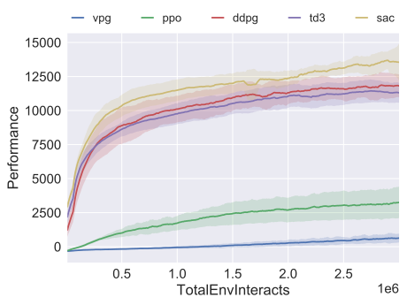
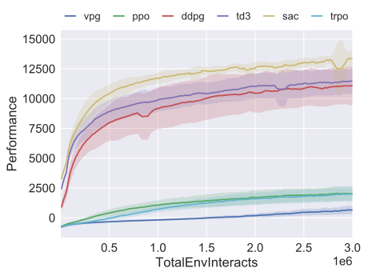
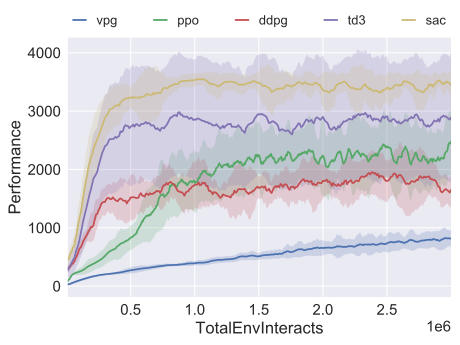
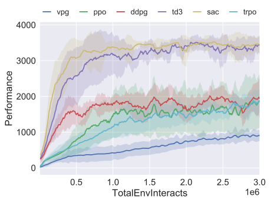
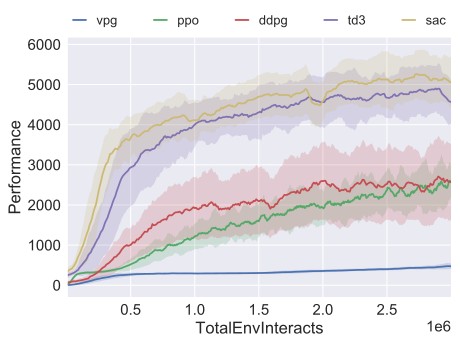
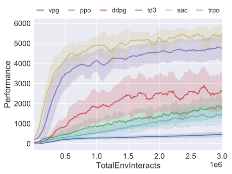
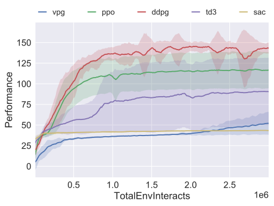
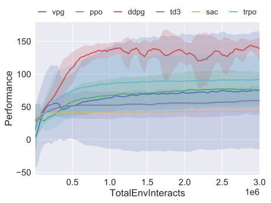
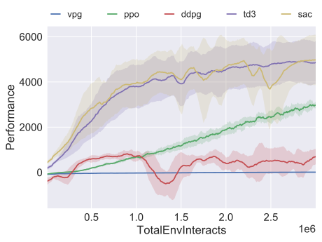
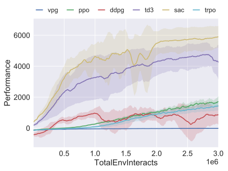

==========
Benchmarks
==========

.. contents:: Table of Contents

We benchmarked the Machine Learning Control algorithm implementations in five environments
from the MuJoCo_ Gym task suite: HalfCheetah, Hopper, Walker2d, Swimmer, and Ant and two
environments from the `simzoo`_ gym environments: Oscillator-v1 and Ex3_EKF.

.. _MuJoCo: https://gym.openai.com/envs/#mujoco
.. _`simzoo`: ../simzoo/simzoo.html

Performance in Each Environment
===============================

Mujoco Environments
-------------------

HalfCheetah: PyTorch Versions
~~~~~~~~~~~~~~~~~~~~~~~~~~~~~

    3M timestep benchmark for HalfCheetah-v3 using **PyTorch** implementations.

.. todo::
    Replace with our own benchmark.

HalfCheetah: Tensorflow Versions
~~~~~~~~~~~~~~~~~~~~~~~~~~~~~~~~

    3M timestep benchmark for HalfCheetah-v3 using **Tensorflow** implementations.

.. todo::
    Replace with our own benchmark.

Hopper: PyTorch Versions
~~~~~~~~~~~~~~~~~~~~~~~~

    3M timestep benchmark for Hopper-v3 using **PyTorch** implementations.

.. todo::
    Replace with our own benchmark.

Hopper: Tensorflow Versions
~~~~~~~~~~~~~~~~~~~~~~~~~~~

    3M timestep benchmark for Hopper-v3 using **Tensorflow** implementations.

.. todo::
    Replace with our own benchmark.

Walker2d: PyTorch Versions
~~~~~~~~~~~~~~~~~~~~~~~~~~

    3M timestep benchmark for Walker2d-v3 using **PyTorch** implementations.

.. todo::
    Replace with our own benchmark.

Walker2d: Tensorflow Versions
~~~~~~~~~~~~~~~~~~~~~~~~~~~~~

    3M timestep benchmark for Walker2d-v3 using **Tensorflow** implementations.

.. todo::
    Replace with our own benchmark.

Swimmer: PyTorch Versions
~~~~~~~~~~~~~~~~~~~~~~~~~

    3M timestep benchmark for Swimmer-v3 using **PyTorch** implementations.

.. todo::
    Replace with our own benchmark.

Swimmer: Tensorflow Versions
~~~~~~~~~~~~~~~~~~~~~~~~~~~~

    3M timestep benchmark for Swimmer-v3 using **Tensorflow** implementations.

.. todo::
    Replace with our own benchmark.

Ant: PyTorch Versions
~~~~~~~~~~~~~~~~~~~~~

    3M timestep benchmark for Ant-v3 using **PyTorch** implementations.

.. todo::
    Replace with our own benchmark.

Ant: Tensorflow Versions
~~~~~~~~~~~~~~~~~~~~~~~~

    3M timestep benchmark for Ant-v3 using **Tensorflow** implementations.

.. todo::
    Replace with our own benchmark.

Simzoo Environments
-------------------

Oscillator: Tensorflow Versions
~~~~~~~~~~~~~~~~~~~~~~~~~~~~~~~

.. todo::
    Replace with our own benchmark.

Oscillator: Tensorflow Versions
~~~~~~~~~~~~~~~~~~~~~~~~~~~~~~~

.. todo::
    Replace with our own benchmark.

Experiment Details
==================

**Random seeds.** All experiments were run for 10 random seeds each. Graphs show the average (solid line) and std dev (shaded) of performance over random seed over the course of training.

**Performance metric.** Performance for the on-policy algorithms is measured as the average trajectory return across the batch collected at each epoch. Performance for the off-policy algorithms is measured once every 10,000 steps by running the deterministic policy (or, in the case of SAC, the mean policy) without action noise for ten trajectories, and reporting the average return over those test trajectories.

**Network architectures.** The on-policy algorithms use networks of size (64, 32) with tanh units for both the policy and the value function. The off-policy algorithms use networks of size (256, 256) with relu units.

**Batch size.** The on-policy algorithms collected 4000 steps of agent-environment interaction per batch update. The off-policy algorithms used mini-batches of size 100 at each gradient descent step.

All other hyperparameters are left at default settings for the Machine Learning Control implementations. See algorithm pages for details.

Learning curves are smoothed by averaging over a window of 11 epochs.

.. admonition:: You Should Know

    By comparison to the literature, the Machine Learning Control implementations of DDPG, TD3, and SAC are roughly at-parity with the best reported results for these algorithms. As a result, you can use the Machine Learning Control implementations of these algorithms for research purposes.

.. _`OpenAI Baselines`: https://github.com/openai/baselines

PyTorch vs Tensorflow
=====================

We provide graphs for head-to-head comparisons between the PyTorch and Tensorflow implementations of each algorithm at the following pages:

* `SAC Head-to-Head`_

* `LAC Head-to-Head`_

.. _`SAC Head-to-Head`: ./bench_sac.html

.. _`LAC Head-to-Head`: ./bench_sac.html

.. todo::
    Replace with our own benchmark.