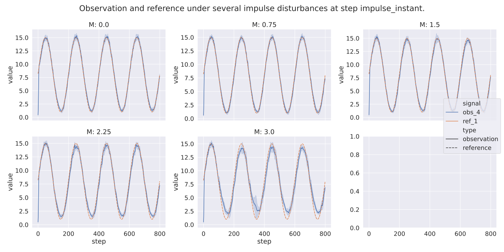
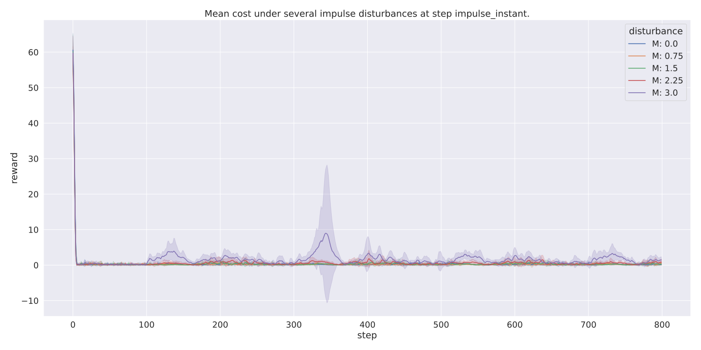

=====================
Evaluating Robustness
=====================

SLC ships with a handy utility for evaluating the policy's robustness. This is done by evaluating the policy performance for several episodes inside a given environment
while also applying several disturbances. You can run it with:

.. parsed-literal::

    python -m stable_learning_control.run eval_robustness [path/to/output_directory ...] [--legend [LEGEND ...]]
        [--xaxis XAXIS] [--value [VALUE ...]] [--count] [--smooth S]
        [--select [SEL ...]] [--exclude [EXC ...]]

.. seealso::

    For more information on all the input arguments, see the :ref:`robustness evaluation utility <robustness_eval>` documentation or code :ref:`api`.

.. important::

    Please note that this tool doesn't work out of the box with OpenAi gym environments or other custom environments. It requires several (non-standard) methods and attributes
    to be present in the gym environment to perform the robustness evaluation. It is, however, relatively easy to make your gym environment compatible with the robustness eval robustness
    tool. Please see the :ref:`env_add` section on how this is done.

Results
=======

Saved files
-----------

The robustness evaluation tool can save several files to disk that contain information about the robustness evaluation:

+--------------------------------------------------------------------------------------------+
| **Output Directory Structure**                                                             |
+-----------------------+--------------------------------------------------------------------+
|``figures/``           | | A directory containing the robustness evaluation plots when the  |
|                       | | ``--save_figs`` flag was used.                                   |
+-----------------------+--------------------------------------------------------------------+
|``eval_statistics.csv``| | File with general performance statistics for the episodes and    |
|                       | | disturbances used during the robustness evaluation.              |
+-----------------------+--------------------------------------------------------------------+
|``results.csv``        | | Pandas data frame containing all the data that was collected for |
|                       | | the episodes and disturbances used during the robustness         |
|                       | | evaluation. This file is only present when the ``--save_results``|
|                       | | flag is set and can be used to create custom plots.              |
+-----------------------+--------------------------------------------------------------------+

Plots
-----

Default plots
^^^^^^^^^^^^^

By default the following plots are displayed when running the robustness evaluation:

    This plot shows how the mean observation (states) paths change under different disturbances. It also
    shows the reference value used for training the algorithm.

.. figure:: ../images/plots/lac/example_lac_robustness_eval_soi_plot.svg
    :align: center

    This plot shows how the states of interest changes under different disturbances.

    This plot show how the mean reward changes under different disturbances.

.. note::

    The ``state_of_interest`` of an environment is the state which the safe RL algorithm tries to minimize or maximize. For the
    :ref:`Oscillator environment <oscillator>` environment this is the difference between the current protein concentration and
    the reference protein concentration. The :ref:`Oscillator environment <oscillator>` expects the RL agent to perform a reference
    tracking task. Another possible ``state_of_interest``,  in the OpenAi gym CartPole environment would be the difference between
    the CardPole angle and a zero angle. This environment would expect the agent to perform a stabilization task. You're free to
    design the ``state_of_interest`` however you like as long as it is returned by the step inside the step info dictionary.

.. _`robust_custom_plots`:

Create custom plots
^^^^^^^^^^^^^^^^^^^

You can also create any plots you like using the ``results.csv`` data frame that is saved during the robustness evaluation. In the
code example below, we use this data frame to plot how observation four, from the :ref:`Oscillator environment <oscillator>` changes
under several Impulse disturbances.

.. code-block:: python

    import argparse
    from pathlib import Path

    import matplotlib.pyplot as plt
    import pandas as pd
    import seaborn as sns

    if __name__ == "__main__":

        # Parse input arguments.
        parser = argparse.ArgumentParser()
        parser.add_argument("fpath", type=str, help="The path where the policy is stored")
        args = parser.parse_args()

        # Retrieve dataframe.
        robustness_eval_df = pd.read_csv(Path(args.fpath).absolute())

        # Retrieve observation and reference data from the dataframe.
        o_disturbances_df = robustness_eval_df.query("variable == 'observation'").dropna(
            axis=1, how="all"
        )
        ref_disturbance_df = robustness_eval_df.query("variable == 'reference'").dropna(
            axis=1, how="all"
        )

        # Merge observations and references into one dataframe.
        obs_df_tmp = o_disturbances_df.query("observation == 3")
        obs_df_tmp["signal"] = "obs_" + (obs_df_tmp["observation"] + 1).astype(str)
        obs_df_tmp.insert(len(obs_df_tmp.columns), "type", "observation")
        ref_df_tmp = ref_disturbance_df.query("reference == 0")
        ref_df_tmp["signal"] = "ref_" + (ref_df_tmp["reference"] + 1).astype(str)
        ref_df_tmp.insert(len(ref_df_tmp.columns), "type", "reference")
        obs_ref_df = pd.concat([obs_df_tmp, ref_df_tmp], ignore_index=True)

        # Plot observation 2 and reference 1 for different disturbance values
        fig = plt.figure(tight_layout=True)
        sns.lineplot(
            data=obs_ref_df,
            x="step",
            y="value",
            ci="sd",
            hue="disturbance",
            style="type",
        ).set_title("Observation 2 and reference 1 for several disturbance values")
        plt.show()

Running this code will give you the following figure:

.. figure:: ../images/plots/lac/example_lac_robustness_eval_custom_plot.svg
    :align: center

    This plot show how a observation 4 of the Oscillator environment changes under different disturbances.

.. _env_add:

How to use custom environments
==============================

As stated above, the robustness evaluation tool uses several (non-standard) methods and attributes to perform the robustness evaluation. As a result, the
robustness evaluation tool expects the following methods and attributes to be present in your gym environment:

+--------------------------------------------------------------------------------------------+
| **Required methods**                                                                       |
+-----------------------+--------------------------------------------------------------------+
|``init_disturber()``   | | **Method** that is responsible for initializing the disturber.   |
|                       | | this method can be used to set up several attributes that are    |
|                       | | used in the ``disturbed_step()`` and ``next_disturbance()``      |
|                       | | methods.                                                         |
+-----------------------+--------------------------------------------------------------------+
|``disturbed_step()``   | | **Method** used to perform the disturbed step this function      |
|                       | | should wrap the :meth:`gym.Env.step` method and add a disturbance|
|                       | | to original returned step.                                       |
+-----------------------+--------------------------------------------------------------------+
|``next_disturbance``   | | **Method** used to loop through the different disturbances you   |
|                       | | want to apply. This method should, for example update the index  |
|                       | | that is used for retrieving the disturbance in the               |
|                       | | ``disturbed_step`` method. It can also be used to change the     |
|                       | | environment state to apply an environment disturbance.           |
+-----------------------+--------------------------------------------------------------------+
|``disturber_done``     | | **Attribute** used to specify whether all the disturbances have  |
|                       | | been looped through.                                             |
+-----------------------+--------------------------------------------------------------------+
|``disturbance_info``   | | *Optional* **Attribute** some additional information about the   |
|                       | | disturbance that can be used for plotting. See the ``Disturber`` |
|                       | | class for an example.                                            |
+-----------------------+--------------------------------------------------------------------+

Therefore, to use the robustness evaluation tool with your own environment, you have to add these methods. The SLC package contains the
:class:`~stable_learning_control.simzoo.simzoo.common.disturber.Disturber` class to ease this process. Your environment can inherit from this
class to add all the required methods and attributes to make it compatible with the robustness eval tool:

.. code-block:: python
    :linenos:
    :emphasize-lines: 3, 6-18, 21, 23, 26-30, 34, 36

    import gym
    import numpy as np
    from stable_learning_control.simzoo.simzoo.common.disturber import Disturber

    # Disturber config used to overwrite the default config.
    DISTURBER_CFG = {
        # Disturbance applied to environment variables.
        "env": {
            "description": "Pole length disturbance",
            # The env variable which you want to disturb.
            "variable": "length",
            # The range of values you want to use for each disturbance iteration.
            "variable_range": np.linspace(0.5, 2.0, num=5, dtype=np.float32),
            # Label used in robustness plots.
            "label": "r: %s",
        },
        "test": {},
    }

    class CartPoleDisturber(Disturber):
        def __init__(self):
            super().__init__(disturber_cfg=DISTURBER_CFG)

        def init_disturber(self, *args, **kwargs):
            kwargs["disturber_cfg"] = (
                {**DISTURBER_CFG, **kwargs["disturber_cfg"]}
                if "disturber_cfg" in kwargs.keys()
                else DISTURBER_CFG
            )
            return super().init_disturber(*args, **kwargs)

    class Oscillator(gym.Env, Disturber):
        def __init__(self, reference_type="periodic", seed=None):
            super().__init__()

In this example, observe that

    * On line 3, we import the Simzoo :class:`~stable_learning_control.simzoo.simzoo.common.disturber.Disturber` class.
    * On line 6-18, we setup the disturbance configuration object (i.e. ``DISTURBANCE_CFG``).
    * On line 21, we create a different environment disturber which wraps the :class:`~stable_learning_control.simzoo.simzoo.common.disturber.Disturber` class.
    * On line 23, we call the initiation method of the :class:`~stable_learning_control.simzoo.simzoo.common.disturber.Disturber` super class.
    * On line 26-30, we make sure the most up to date version of the disturbance config is used during the robustness evaluation (see the :ref:`see also box<see_also_pickled>` below for more information).
    * On line 34, we inherit from the newly created environment disturber wrapper such that all the required methods and attributes for using the environment with the robustness evaluation tool are present.
    * On line 36, we make sure the initiation method of the wrapper class gets called.

For a good example of how this is done, one can look at the ``<ENV_NAME>_disturber.py`` files in any Simzoo environment folders.

.. _see_also_pickled:

.. seealso::

    One might observe that we can also inherit from the :class:`~stable_learning_control.simzoo.simzoo.common.disturber.Disturber` class directly. The downside of doing this is that the robustness evaluation
    tool then uses the disturbance configuration used during training. This is because the gym environment and disturber wrapper loaded during the robustness evaluation tool are saved in a pickled format. If
    one decides to use this method you should directly modify the ``DISTURBANCE_CFG`` inside the :class:`~stable_learning_control.simzoo.simzoo.common.disturber.Disturber` class file.

How to find available disturbances
==================================

When using the :ref:`robustness eval CLI <robustness_eval>` you can use the ``--list_disturbance_types`` and ``--list_disturbance_variants`` flags to list the available disturbance types and variants for a given agent trained in a given
environment. For more details, one should check the check the ``DISTURBANCE_CFG`` constant inside the :class:`~stable_learning_control.simzoo.simzoo.common.disturber.Disturber` class file or the environment
``<ENV_NAME>_disturber.py`` file.

Change the shape of a disturbance
=================================

The disturbances shapes are specified in a ``DISTURBANCE_CFG`` variable that can be found in the :class:`~stable_learning_control.simzoo.simzoo.common.disturber.Disturber` class
or any environment disturber (i.e. ``<ENV_NAME>_disturber.py`` file inside the environment folder). The robustness evaluation script first looks at the ``DISTURBANCE_CFG`` inside the environment wrapper and then at the one in the
:class:`~stable_learning_control.simzoo.simzoo.common.disturber.Disturber` class. As a result, values defined in the ``DISTURBANCE_CFG`` of the environment disturber take precedence over
values that are defined in the :class:`~stable_learning_control.simzoo.simzoo.common.disturber.Disturber` class. Below some several important characteristics of the ``DISTURBANCE_CFG`` that is found in the
:class:`~stable_learning_control.simzoo.simzoo.common.disturber.Disturber` class are explained.

Disturbance configuration structure
-----------------------------------

When editing the ``DISTURBANCE_CFG`` config in the :class:`~stable_learning_control.simzoo.simzoo.common.disturber.Disturber` class one has to remember the following:

- The config of a disturbance requires *ONE* key with the ``range`` suffix. The :class:`~stable_learning_control.simzoo.simzoo.common.disturber.Disturber` uses this suffix to determine which key holds the range the disturber should loop through.

.. code-block:: python
    :linenos:
    :emphasize-lines: 5

    # A random noise that is applied at every timestep.
    "noise": {
        "description": "Random noise disturbance",
        # The means and standards deviations of the random noise disturbance.
        "noise_range": {
            "mean": np.linspace(80, 155, num=3, dtype=np.int16),
            "std": np.linspace(1.0, 5.0, num=3, dtype=np.int16),
        },
        # Label used in robustness plots.
        "label": "x̅: %s, σ: %s",
    },

- The disturbance range can be supplied as a ``1D`` or ``2D`` NumPy array. When you provide the disturbance range as a ``1D`` array (see code example above), it will be applied to all actions/observations. By supplying the disturbance range as a ``2D`` array (see code example below),
  you can individually control each action/observation disturbance.

.. code-block:: python
  :linenos:
  :emphasize-lines: 11-18, 20-28

    # Disturbance applied to the *OUTPUT* of the environment step function
    "output": {
        # The disturbance variant used when no variant is given.
        "default_variant": "impulse",
        # A random noise that is applied at every timestep.
        "noise": {
            "description": "Random noise disturbance",
            # The means and standards deviations of the random noise disturbance.
            "noise_range": {
                # "mean": np.linspace(80, 155, num=3, dtype=np.int16),  # All obs.
                "mean": np.vstack(
                    (
                        np.linspace(80, 155, num=3, dtype=np.int16),  # Obs 1
                        np.linspace(80, 155, num=3, dtype=np.int16),  # Obs 2
                        np.linspace(80, 155, num=3, dtype=np.int16),  # Obs 3
                        np.linspace(80, 155, num=3, dtype=np.int16),  # Obs 4
                    )
                ).T,
                # "std": np.linspace(1.0, 5.0, num=3, dtype=np.int16),  # All Obs.
                "std": np.vstack(
                    (
                        np.linspace(1.0, 5.0, num=3, dtype=np.int16),  # Obs 1
                        np.linspace(1.0, 5.0, num=3, dtype=np.int16),  # Obs 2
                        np.linspace(1.0, 5.0, num=3, dtype=np.int16),  # Obs 3
                        np.linspace(1.0, 5.0, num=3, dtype=np.int16),  # Obs 4
                    )
                ).T,
            },
            # Label used in robustness plots.
            "label": "x̅: %s, σ: %s",
        },
    },

.. important::
    When doing this, you have to make sure that the size of your ``2D`` array is equal to the number of actions (in the case of an input disturbance) or observations (in the case of an output disturbance).

- A ``combined`` disturbance should contain *ONE* key with the ``input`` prefix and *ONE* key with the ``output`` prefix. The :class:`~stable_learning_control.simzoo.simzoo.common.disturber.Disturber` uses this prefix to distinguish between the input and output disturbance.

.. code-block:: python
    :linenos:
    :emphasize-lines: 4, 12

    # Input and output noise disturbance.
    "noise": {
        "description": "Random input and output noise disturbance",
        "input_noise": {
            # The means and standards deviations of the random input noise
            # disturbance.
            "noise_range": {
                "mean": np.linspace(80, 155, num=3, dtype=np.int16),
                "std": np.linspace(1.0, 5.0, num=3, dtype=np.int16),
            },
        },
        "output_noise": {
            # The means and standards deviations of the random output noise
            # disturbance.
            "noise_range": {
                "mean": np.linspace(80, 155, num=3, dtype=np.int16),
                "std": np.linspace(1.0, 5.0, num=3, dtype=np.int16),
            },
        },
        # Label used in robustness plots.
        "label": "x̅: (%s, %s), σ: (%s, %s)",
    },

- The length of the disturbance range variables (i.e. ``<VARIABLE>_range``) should be equal between the input and output disturbance. Please note that the zero disturbance is added automatically by the disturber and is not
  included when determining the length.
- The length of the ``mean`` and ``std`` keys of the ``noise_range`` should also be equal.
- The disturber currently only allows for one range key to be enabled. This means that in the ``periodic`` noise config, either the ``amplitude_range``, the ``frequency_range`` or ``phase_range`` can be un-commented.
- The number of string substitution operators (i.e. ``%``) in the disturbance label should be equal to the number of variables found in the disturbance range variable (i.e. ``<VARIABLE>_range``).

How to add new disturbances
==============================

A custom disturbance can be added to the :class:`~stable_learning_control.simzoo.simzoo.common.disturber.Disturber` class or any class that inherits from this
class. You can then make your new disturbance available to be used with the robustness evaluation tool by making sure your gym environment inherits from this
modified disturber. You can then choose this new disturbance using the ``-d_type`` and ``-d_variant`` flags.

Manual robustness evaluation
============================

A script version of the eval robustness tool can be found in the ``examples`` folder (i.e. :slc:`eval_robustness.py <blob/main/examples/eval_robustness.py>`). This script can be used when you want to perform some quick tests without implementing a disturber
class for your given environment.
