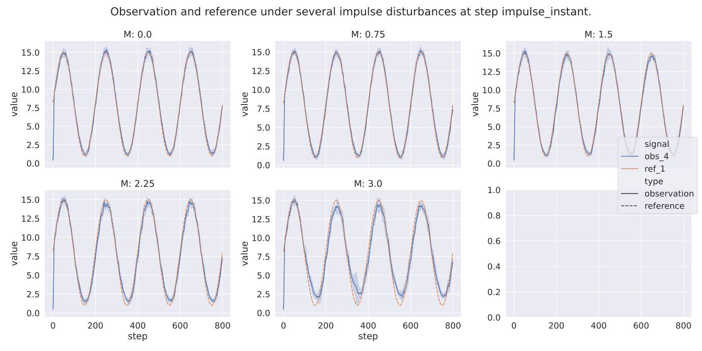
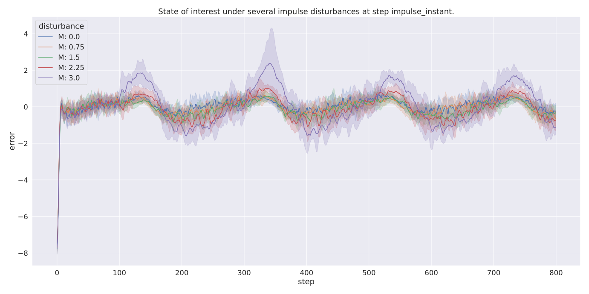
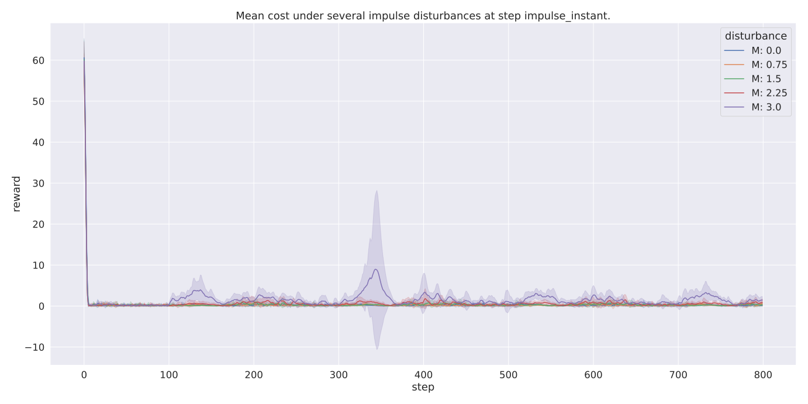
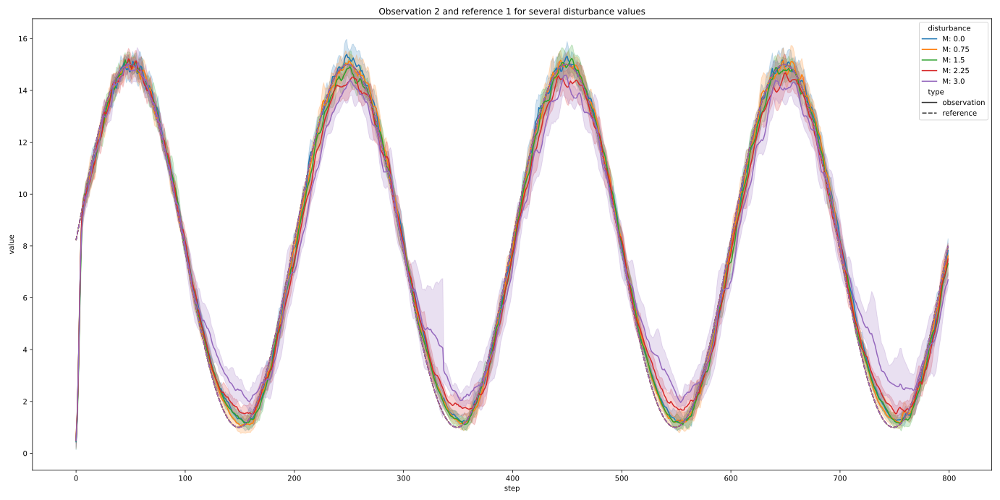

=====================
Evaluating Robustness
=====================

BLC ships with a handy utility for evaluating the policy's robustness. This is done by evaluating the policy performance for several episodes inside a given environment
while also applying several disturbances. You can run it with:

.. parsed-literal::

    python -m bayesian_learning_control.run eval_robustness [path/to/output_directory ...] [--legend [LEGEND ...]]
        [--xaxis XAXIS] [--value [VALUE ...]] [--count] [--smooth S]
        [--select [SEL ...]] [--exclude [EXC ...]]

.. seealso::

    For more information on all the input arguments, see the :ref:`robustness evaluation utility <robustness_eval>` documentation or code :ref:`api`.

.. important::

    Please note that this tool doesn't work out of the box with OpenAi gym environments or other custom environments. It requires several (non-standard) methods and attributes
    to be present in the gym environment to perform the robustness evaluation. It is, however, relatively easy to make your gym environment compatible with the robustness eval robustness
    tool. Please see the :ref:`env_add` section on how this is done.

Results
=======

Saved files
-----------

The robustness evaluation tool can save several files to disk that contain information about the robustness evaluation:

+--------------------------------------------------------------------------------------------+
| **Output Directory Structure**                                                             |
+-----------------------+--------------------------------------------------------------------+
|``figures/``           | | A directory containing the robustness evaluation plots when the  |
|                       | | ``--save_figs`` flag was used.                                   |
+-----------------------+--------------------------------------------------------------------+
|``eval_statistics.csv``| | File with general performance statistics for the episodes and    |
|                       | | disturbances used during the robustness evaluation.              |
+-----------------------+--------------------------------------------------------------------+
|``results.csv``        | | Pandas data frame containing all the data that was collected for |
|                       | | the episodes and disturbances used during the robustness         |
|                       | | evaluation. This file is only present when the ``--save_results``|
|                       | | flag is set and can be used to create custom plots.              |
+-----------------------+--------------------------------------------------------------------+

Plots
-----

Default plots
^^^^^^^^^^^^^

By default the following plots are displayed when running the robustness evaluation:

    This plot shows how the mean observation (states) paths change under different disturbances. It also
    shows the reference value used for training the algorithm.

    This plot shows how the states of interest changes under different disturbances.

    This plot show how the mean reward changes under different disturbances.

.. note::

    The ``state_of_interest`` of an environment is the state which the safe RL algorithm tries to minimize or maximize. For the
    :ref:`Oscillator environment <oscillator>` environment this is the difference between the current protein concentration and
    the reference protein concentration. The :ref:`Oscillator environment <oscillator>` expects the RL agent to perform a reference
    tracking task. Another possible ``state_of_interest``,  in the OpenAi gym CartPole environment would be the difference between
    the CardPole angle and a zero angle. This environment would expect the agent to perform a stabilization task. You're free to
    design the ``state_of_interest`` however you like as long as it is returned by the step inside the step info dictionary.

.. _`robust_custom_plots`:

Create custom plots
^^^^^^^^^^^^^^^^^^^

You can also create any plots you like using the ``results.csv`` data frame that is saved during the robustness evaluation. In the
code example below, we use this data frame to plot how observation four, from the :ref:`Oscillator environment <oscillator>` changes
under several Impulse disturbances.

.. code-block:: python

    import argparse
    from pathlib import Path

    import matplotlib.pyplot as plt
    import pandas as pd
    import seaborn as sns

    if __name__ == "__main__":

        # Parse input arguments
        parser = argparse.ArgumentParser()
        parser.add_argument("fpath", type=str, help="The path where the policy is stored")
        args = parser.parse_args()

        # Retrieve dataframe
        robustness_eval_df = pd.read_csv(Path(args.fpath).absolute())

        # Retrieve observation and reference data from the dataframe
        o_disturbances_df = robustness_eval_df.query("variable == 'observation'").dropna(
            axis=1, how="all"
        )
        ref_disturbance_df = robustness_eval_df.query("variable == 'reference'").dropna(
            axis=1, how="all"
        )

        # Merge observations and references into one dataframe
        obs_df_tmp = o_disturbances_df.query("observation == 3")
        obs_df_tmp["signal"] = "obs_" + (obs_df_tmp["observation"] + 1).astype(str)
        obs_df_tmp.insert(len(obs_df_tmp.columns), "type", "observation")
        ref_df_tmp = ref_disturbance_df.query("reference == 0")
        ref_df_tmp["signal"] = "ref_" + (ref_df_tmp["reference"] + 1).astype(str)
        ref_df_tmp.insert(len(ref_df_tmp.columns), "type", "reference")
        obs_ref_df = pd.concat([obs_df_tmp, ref_df_tmp], ignore_index=True)

        # Plot observation 2 and reference 1 for different disturbance values
        fig = plt.figure(tight_layout=True)
        sns.lineplot(
            data=obs_ref_df,
            x="step",
            y="value",
            ci="sd",
            hue="disturbance",
            style="type",
        ).set_title("Observation 2 and reference 1 for several disturbance values")
        plt.show()

Running this code will give you the following figure:

    This plot show how a observation 4 of the Oscillator environment changes under different disturbances.

.. _env_add:

How to use custom environments
==============================

As stated above, the robustness evaluation tool uses several (non-standard) methods and attributes to perform the robustness evaluation. As a result, the
robustness evaluation tool expects the following methods and attributes to be present in your gym environment:

+--------------------------------------------------------------------------------------------+
| **Required methods**                                                                       |
+-----------------------+--------------------------------------------------------------------+
|``init_disturber()``   | | **Method** that is responsible for initializing the disturber.   |
|                       | | this method can be used to set up several attributes that are    |
|                       | | used in the ``disturbed_step()`` and ``next_disturbance()``      |
|                       | | methods.                                                         |
+-----------------------+--------------------------------------------------------------------+
|``disturbed_step()``   | | **Method** used to perform the disturbed step this function      |
|                       | | should wrap the :meth:`gym.Env.step` method and add a disturbance|
|                       | | to original returned step.                                       |
+-----------------------+--------------------------------------------------------------------+
|``next_disturbance``   | | **Method** used to loop through the different disturbances you   |
|                       | | want to apply. This method should, for example update the index  |
|                       | | that is used for retrieving the disturbance in the               |
|                       | | ``disturbed_step`` method. It can also be used to change the     |
|                       | | environment state to apply an environment disturbance.           |
+-----------------------+--------------------------------------------------------------------+
|``disturber_done``     | | **Attribute** used to specify whether all the disturbances have  |
|                       | | been looped through.                                             |
+-----------------------+--------------------------------------------------------------------+
|``disturbance_info``   | | *Optional* **Attribute** some additional information about the   |
|                       | | disturbance that can be used for plotting. See the ``Disturber`` |
|                       | | class for an example.                                            |
+-----------------------+--------------------------------------------------------------------+

Therefore, to use the robustness evaluation tool with your own environment, you have to add these methods. The BLC package contains the
:class:`~bayesian_learning_control.simzoo.simzoo.common.disturber.Disturber` wrapper class to ease this process. Your environment can inherit from this
class to add all the required methods and attributes to make it compatible with the robustness eval tool:

.. code-block:: python

    # Disturber config used to overwrite values in the default config
    DISTURBER_CFG = {
        # Disturbance applied to environment variables
        "env_disturbance": {
            "description": "Lacl mRNA decay rate disturbance",
            # The env variable which you want to disturb
            "variable": "_c1",
            # The range of values you want to use for each disturbance iteration
            "variable_range": np.linspace(1.0, 3.0, num=5, dtype=np.float32),
            # Label used in robustness plots.
            "label": "r: %s",
        },
    }

    # Make sure your environment inhertis from the disturber class
    class Oscillator(gym.Env, Disturber):
        def __init__(self, reference_type="periodic", seed=None):
            super().__init__(disturber_cfg=DISTURBANCE_CFG)

The :obj:`disturber_cfg` input argument can be used to overwrite the default disturbance config that is specified in the :class:`~bayesian_learning_control.simzoo.simzoo.common.disturber.Disturber`
class.

Change the shape of a disturbance
=================================

The disturbances' shapes are specified in a ``disturber_cfg`` variable that can be found in the :class:`~bayesian_learning_control.simzoo.simzoo.common.disturber.Disturber` class
or any environment that inherits from this class. The robustness evaluation script first looks at the ``disturber_cfg`` inside the environment and then at the one in the
:class:`~bayesian_learning_control.simzoo.simzoo.common.disturber.Disturber` class. As a result, values defined in the ``disturber_cfg`` of the environment take precedence over
values that are defined in the :class:`~bayesian_learning_control.simzoo.simzoo.common.disturber.Disturber` class.

How to add new disturbances
==============================

A custom disturbance can be added to the :class:`~bayesian_learning_control.simzoo.simzoo.common.disturber.Disturber` class or any class that inherits from this
class. You can then make your new disturbance available to be used with the robustness evaluation tool by making sure your gym environment inherits from this
modified disturber. You can then choose this new disturbance using the ``-d_type`` and ``-d_variant`` flags.
