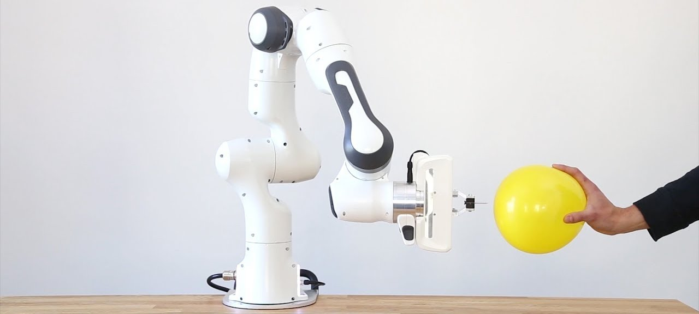

.. Bayesian Learning Control master file, created by
   sphinx-quickstart on Wed Aug 15 04:21:07 2018.
   You can adapt this file completely to your liking, but it should at least
   contain the root `toctree` directive.

Welcome to Bayesian Learning Control!
=====================================

.. warning::

   The Bayesian Learning Control framework is still in its development state. We can, therefore, not guarantee
   that it is bug-free. Please open :issue:`an issue<>` if you experience problems or something is unclear.

Welcome to the :blc:`Bayesian Learning Control <>` (BLC) framework! The BLC framework enables
you to automatically create, train and deploy various safe (stable and robust) Reinforcement Learning (RL) and
Imitation learning (IL) control algorithms directly from real-world data. This framework
is made up of four main modules:

* `Modeling`_: Module that uses state of the art System Identification and State Estimation techniques to create an `Openai gym`_ environment out of real data.
* `Simzoo`_: Module that contains several already created BLC `Openai gym`_ environments.
* `Control`_: Module used to train several BLC RL/IL agents on the built gym environments.
* `Hardware`_: Module that can be used to deploy the trained RL/IL agents onto the hardware of your choice.

Apart from these main modules, it also comes with several (shared) utilities:

* :ref:`CLI <runner>`: A command-line interface (CLI) that can be used to run all the modules inside the BLC framework.
* :ref:`Loggers <loggers>`: Several loggers that can be used to log data to the stdout, a file or Tensorboard.
* :ref:`MPI Tools <mpi>`: Tools for running your scripts across data-parallel MPI processes

.. note::
   This framework was build upon the `SpinningUp`_ educational resource. By doing this, we hope to make
   it easier for new researchers to get started with our Algorithms. If you are new to RL, you are highly
   encouraged to check out the SpinningUp documentation and play with it before diving into our codebase. Our
   implementation sometimes deviates from the `SpinningUp`_ version to increase code maintainability, extensibility, and readability.

.. _`Loggers`: ./utils/loggers.html
.. _`MPI Tools`: ./utils/mpi.html
.. _`Modeling`: ./modeling/modeling.html
.. _`Simzoo`: ./simzoo/simzoo.html
.. _`Control`: ./control/control.html
.. _`Hardware`: ./hardware/hardware.html
.. _`SpinningUp`: ./hardware/hardware.html
.. _`Openai gym`: https://gym.openai.com/

.. toctree::
   :maxdepth: 3
   :caption: Getting Started

   user/installation
   user/usage

.. toctree::
   :maxdepth: 3
   :caption: Modeling

   modeling/modeling

.. toctree::
   :maxdepth: 3
   :caption: Control

   control/algorithms
   control/running
   control/tuning
   control/saving_and_loading
   control/plotting
   control/eval_robustness
   control/bench
   control/control_utils

.. toctree::
   :maxdepth: 3
   :caption: Hardware

   hardware/hardware

.. toctree::
   :maxdepth: 3
   :caption: Simzoo

   simzoo/simzoo

.. toctree::
   :maxdepth: 3
   :caption: Shared Utilities

   utils/runner
   utils/loggers
   utils/mpi

.. toctree::
   :maxdepth: 3
   :caption: Developer Zone

   dev/api/api.rst
   dev/release_dev.rst
   dev/doc_dev.rst

.. toctree::
   :maxdepth: 3
   :caption: Etc.

   etc/acknowledgements
   etc/author

Indices and tables
==================

* :ref:`genindex`
* :ref:`modindex`
* :ref:`search`
