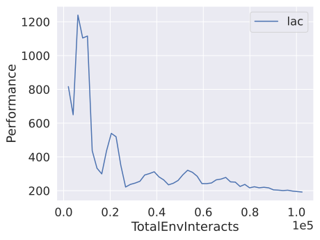

.. _plotting:

================
Plotting Results
================

SLC ships with a simple plotting utility that can be used to plot diagnostics from experiments. You can run it with:

.. parsed-literal::

    python -m stable_learning_control.run plot [path/to/output_directory ...] [-h] [--legend [LEGEND [LEGEND ...]]] 
        [--xaxis XAXIS] [--value [VALUE [VALUE ...]]] [--count] [--smooth SMOOTH]
        [--select [SELECT [SELECT ...]]] [--exclude [EXCLUDE [EXCLUDE ...]]] [--est EST]

.. seealso::

    For more information on this utility, see the :ref:`plot utility <plot>` documentation or code :ref:`the API reference <autoapi>`.

    Example plot that displays the performance of the LAC algorithm.

..  tip::

    The SLC package also supports TensorBoard and Weights & Biases logging. See :ref:`loggers` for more information. This allows you
    to inspect your experiments' results during training and compare the performance of different algorithms more interactively.
